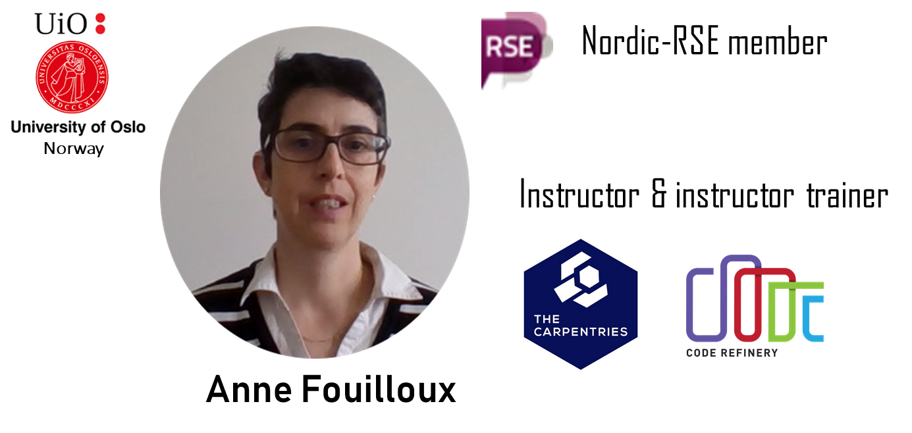

class: center, middle, inverse

# How to scale up your online workshop to reach 100 learners?

### Naoe Tatara, Radovan Bast, Richard Darst, Anne Fouilloux, Petri Jehkonen, Matúš Kalaš, Samantha Wittke

---

## Introduction to the session

- Carpentries Code of Conduct
- House keeping
 - Questions about the contents -> HackMD
 - Questions about technical stuff -> Zoom Chat
- Contents
 - What is CodeRefinery?
 - A vision of reaching many people at once (with BR session)
 - How we did it
 - Role presentation
 - Open discussion

---

## CodeRefinery: project and funding

<!-- RB, 5 minutes, 3 slides -->

(Radovan will add logo and/or map)

- Funded 2016-2021 by [Nordic e-Infrastructure Collaboration (NeIC)](https://neic.no/)
- Co-funding by Sigma2 (Norway), SNIC (Sweden), DeiC (Denmark), CSC (Finland), ETAIS (Estonia)
- Important hubs: NTNU Trondheim, University of Oslo, KTH Stockholm, Aalto University
- Trained over 700 learners [in over 30 workshops](https://coderefinery.org/workshops/past/)

---

## CodeRefinery: audience and lessons

Our **learners are not pure beginners**, they already develop code but want to
become better at **collaboration and reproducibility**

### Typical workshop

- Introduction to version control
- Collaborative distributed version control
- Reproducible research and FAIR data
- Social coding and open software
- Documentation
- Jupyter
- Automated testing
- Modular code development

### More lessons

https://coderefinery.org/lessons/

---

## CodeRefinery: relation to Carpentries

- Using Carpentries teaching style and format
- Co-funding Carpentries coordinator Nordics/Baltics
- Lessons are not yet in the Carpentries incubator

### Questions to the audience

- Is there a need for more intermediate/advanced Carpentries-style material for
  learners who have completed a basic Carpentries training?
- What topics/courses are needed?

*Please answer via HackMD*

---

## A vision of reaching many people at once

<!-- RD -->

--

---

## A vision of reaching many people at once

<!-- RD drafts this, 2+10+3 minutes -->

- Our previous workshops weren't very large
- The promise of technology is to be able to reach huge numbers of
  people at once.  But is that too impersonal?
- Surely we must be able to get the best of best worlds...
- With a consistent vision, yes, you can reach many people.  But it
  requires that vision from the start, and everything supporting that
  value.

### Questions to the audience

- How can large be more inclusive?  How is it less?
- What technical obstacles does it have?

10 minutes to discuss in breakout rooms, summarize here after.

<!--
- Why you need a vision (Mega-Coderefinery vs HPC kickstart)
- You can get even *more* out of it
- Question to audience via breakout room, answers in HackMD:
  - How can large be more inclusive?  How is it less?
  - What technical obstacles does it have?
- Do we discuss results in main room?
-->

---

class: center, middle, inverse

# How we did it

### Lectures & code-along exercises in the main room

### Get help and group exercises in a breakout room

### Bring your own breakout room

## An effective team work!

---

## Lectures & code-along exercises in the main room

- Short lectures to explain a concept and "asynchronous Q&A" in main room
- Demonstrate it on a very short example (and often repeat explanation)
- Exercises more in the breakout rooms among groups
- Check understanding:
	- surveys with simple (yes/no) questions
	- check speed with faster/slower buttons
	- ask a question and learners write down answers in hackMD
	- ask learners to contribute to discussion via hackMD
- Sometimes make a code-along exercise and always repeat similar exercise in breakout rooms

*Move on when about 70% have answered so delegate potential misunderstanding to helpers during group exercises.
*
---

## Get help and group exercises in a breakout room

- Apply concepts previously taught to check understanding
- Helpers often "taught" again to clarify concept
- pre-defined and fixed breakout rooms with 3 to 10 people in each:
	- larger groups were allowed when learners registered together
	- helpers played a key role to animate the group
	- encouraged one learner to share his/her screen during the exercise

*First day was a bit quiet, especially in groups where learners did not know each others.
*
---

## Bring your own breakout room

- Learners could register as a team (3-10 persons) with a designated helper:
	- Registration form included a “team name”
	- Personalized emails with room numbers
	- Zoom name = “(5) Richard Darst” or “(5,H) Richard Darst”

- The designated helper was very often someone who already attended a CodeRefinery in-person workshop or someone in charge of technical support for the team

*This is how we effectively scaled...*

---

## Helper training

[RB drafts this, 2 minutes]

- ...

---

## Hierarchical helpers

[RB drafts this, 2 minutes]

- ...

---

## Required preparation, install times

[RD drafts this, 2 minutes]

- With 100 people, there is very little tolerance for technical
  problems.
- Huge emphasis: install and *test* software before, said in every email.
- Two pre-workshop "verification times", request that everyone attends
  (if half do, it's good enough)
- In the verification time, we would pair learners with helpers and
  have them test git and Python (not just install, but settings).
- Verification times also let us practice with the tech with helpers in advance.

---

## Collaborative notes

- Use of HackMD for collection of Q&A regarding lesson contents
<ul style="list-style-type:' \002B \0020 \0020'">
  <li> It keeps record of Q&A so that it is possible to review afterwards.</li>
  <li> Main flow is not disrupted.</li>
  <li> Stable most of the time with 50-100 users (depending on the edit history length).</li>
</ul>

- For short communications for more practical questions, we used Zoom chat function.

---

## Distribution of roles

---

## Streaming and recording

[RD drafts this, 2 minutes]

- If we have 100 people, interaction shifts to breakout rooms.  Why
  can't more watch the lecture?
- Zoom meetings are *not* the right format for untrusted people to watch.
- Streaming is the right format: listeners isolated from presenters,
  no risk of damage.
- Zoom can stream directly to Twitch (or other services) without any
  other software needed.
- We interacted with Twitch viewers via Twitch chat + hackmd.  It
  worked fairly well.

---

class: center, middle, inverse

# Role presentations

<!--NT will moderate this session, 20 minutes　-->

<!-- - They should: say what the role is, why the role is important, say what -->
<!--   you thought, what went well, what should be improved.  Please also check -->
<!--   what the other roles are, so that you can focus on what makes your role -->
<!--   special -->
<!--     - one slide per role -->
<!--     - Naoe starts this session by giving word to the speakers -->

---

## Learner

- Backround
- Expectation
- Arrangements:  Pre-workshop, Materials, learning tools, support organization
- Challenges
- Overall feedback
- Outcome

...

---

## Helper

[MK drafts this, 2 minutes]

- ...

---

## Learner/helper on a team

&nbsp;

- **helper in team** from Finnish Geospatial Research Institute
- myself: in-person workshop **learner one year ago**
- **lower barrier** to interact/ask questions
- explaining topics **work-related**
- **easy to get lost** in course-unrelated topics

---

## Expert helper

[RB drafts this, 2 minutes]

- ...

---

## Instructor

### Who am I?

### How was it to teach Mega-CR online?

- Taught from home with one screen (laptop)
- Less pressure and easier to focus on the teaching thanks to CR team work (host, helpers, hackMD, etc.)
- Need to have short assessments (surveys, questionnaires, etc.) frequently
- Code-along sessions were sometimes too fast for many learners and often became demos
- Useful to be instructor and expert helper during the workshop

---

## Host

Host is dedicated for Zoom room management.
- Zoom-participant controll
  - Assigning co-host priviledge to instructors and expert helpers.
  - Permission of participants' entrance into the meeting room by referring to the registration list.
  <ul style="list-style-type:' \0021 \0020 \0020'">
    <li> Join in early </li>
    <li> Present registered name </li>
    <li> Rename to (team number / team number, H / CR)[first, last name] </li>
  </ul>
- Communication with participants (mainly via Zoom chat for practical things)
- Assigning participants to breakout rooms
<ul style="list-style-type:' \0021 \0020 \0020'">
  <li> If a helper of a team is absent, 2 (or 3 ) teams are merged into 1 room </li>
  <li> Keep consistency with team combination as much as possible throughout the workshop </li>
  <li> Make sure to stop video before returning to the main room </li>
  <li> Disable waiting room during the breakout room session </li>
</ul>

---

## HackMD specialist

<!-- RD, 2 minutes -->

- This role focuses on watching the HackMD and answering questions
  there.
  - This requires a different type of attention than paying attention to
    lessons, so we have a dedicated role for this.
  - Everyone can help with answering questions, but at least one person
    always dedicated to it.
- Typical tasks
  - Answer questions
  - Bring up important questions to the instructor
  - Organize/comment on complicated answers
  - Add links and "meta-information" about where we are.
  - Ensures consistent formatting, prepares it for publication

---

class: center, middle, inverse

## Future outlook and Q&A session

---

## Future outlook and Q&A session

<!-- RB, 10 minutes, q&a and "discussion" via hackmd -->

- Continue with online workshops - this is not replacement to
  in-person workshops but better in some ways
- Do larger online-workshops and streaming work for all audience types?
  (diversity, tech background, network bandwidth)
- Encourage and accept lurkers more (better experience when streaming).
- How to encourage participation and protect privacy while streaming/recording?
- How can we make a federated model via the stream? We don't know yet.
